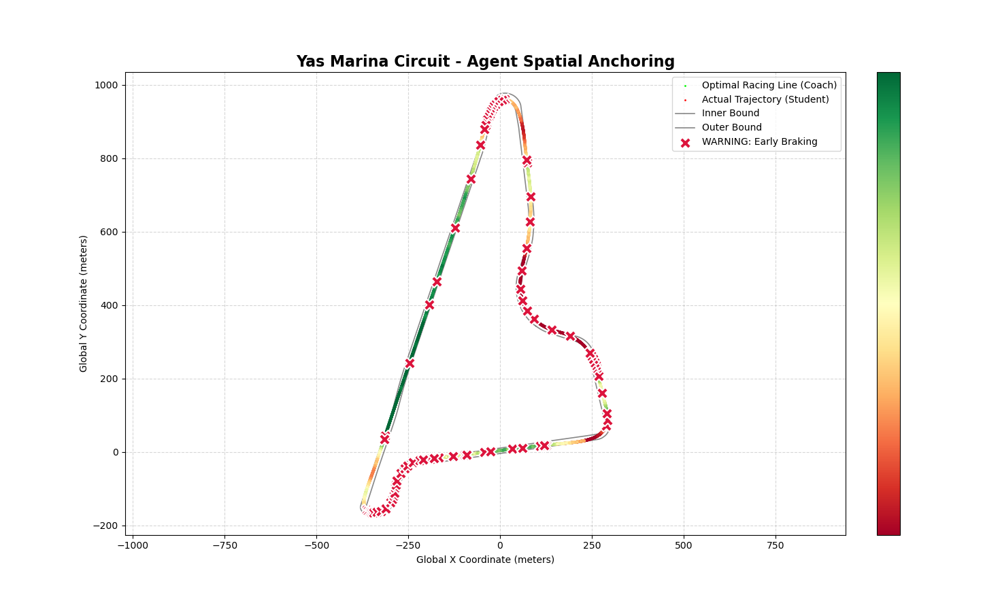

# Racing Smart Coach — Constructor GenAI Hackathon 2026
> Live telemetry visualization and coaching system for autonomous racing.  
> Streams real-world race telemetry from **Yas Marina Circuit** into [Foxglove Studio](https://foxglove.dev), overlaying driving data onto the live camera feed with a full HUD.

---

## Yas Marina Circuit - Spatial Anchoring


## Video demo


## Authors
Boburjon Radjapov<br />
Yiheng Cao<br />
Giorgi Trapaidze<br />

## Repository structure

```
.
├── point_parse.py              # Offline coaching analysis (KD-Tree spatial matching + AR overlay)
├── help_functions.py           # Helper functions used by point_parse.py
├── server.py                   # Live Foxglove WebSocket streaming server
├── intrinsics/
│   └── camera_fl_info.yaml     # Camera calibration — intrinsics K + distortion coefficients
├── yas_marina_bnd.json         # Yas Marina circuit boundary polygons
├── hackathon_fast_laps.mcap    # ⚠ Place in root — fast lap camera + pose (main playback)
└── hackathon_good_lap.mcap     # ⚠ Place in root — reference lap for coaching overlay
```

---

## Quick start

```bash
pip install -r requirements.txt
```

### Offline coaching analysis (`point_parse.py`)

Ensure `hackathon_good_lap.mcap` and `hackathon_fast_laps.mcap` are placed in the root directory, then run:

```bash
python3 point_parse.py
```

### Live Foxglove server (`server.py`)

```bash
python3 -m venv venv
source venv/bin/activate
pip install -r requirements.txt
python3 server.py
```

Wait for the terminal to print `Server live at ws://localhost:8888`, then open Foxglove Studio and connect to:

```
ws://localhost:8888
```

To connect from another device on the same network, use `ws://<your-machine-ip>:8888`.

> **Note:** On first run, `server.py` extracts state data from both MCAPs into `.npy` cache files (~30 seconds). Subsequent starts skip this step.

---

## What each script does

### `point_parse.py` — Offline coaching analysis

Reads both MCAP recordings and produces an annotated video showing where the student driver made conservative mistakes compared to the coach's reference lap.

- **Green trajectory** — the coach's racing line projected into the camera image (absolute spatial coordinates)
- **Red dots with white centres** — positions where the student was measurably conservative in the previous lap

### `server.py` — Live Foxglove stream

Reads both MCAP recordings and streams everything live over WebSocket to Foxglove Studio:

- **Camera feed** — front-left camera from the fast lap, decoded and annotated in real time
- **Dotted racing line** — reference lap projected onto the camera image (3D → 2D via real camera intrinsics); color shifts green → orange → red based on braking intensity
- **Speedometer** — bottom-right digital display, speed in km/h with a segmented color bar (blue → green → yellow → orange → red, 0–280 km/h)
- **GAS / BRAKE bars** — top-right input panel, throttle and brake pressure as vertical bars with live color feedback
- **Turn warnings** — detects sharp corners ahead on the reference lap; shows distance on screen and fires a voice warning once per turn per lap
- **Minimap** — bottom-left circular mini-map showing both laps and the car's current position; rotates so the car always points up
- **3D scene** — top-down view with the car, both lap lines, and Yas Marina track boundaries

---

## Technical highlights

### 1 · Spatial anchoring over time-series

We use a **KD-Tree** for 3D absolute-space mapping instead of traditional timestamp alignment, because the coach and the student are never in the same place at the same timestamp. Nearest-neighbour queries in world space give a geometrically correct match regardless of lap time differences.

### 2 · 3D AR projection engine

No game engine is used. We decompose the camera's intrinsic matrix **K** and extrinsic parameters **[R|T]** from the YAML calibration file, then apply **frustum Z-culling** to project world-space points directly into pixel coordinates:

```
p_cam  =  R · p_world + T
p_img  =  K · [R|T] · P_world

u = fx · (X/Z) + cx
v = fy · (Y/Z) + cy
```

Points with Z ≤ 0 or outside the image frustum are discarded before rendering.

### 3 · Ready for high-frequency sensor fusion

The current architecture runs on a **9-dimensional state tensor** and is already validated on live MCAP data. It is fully ready to connect to:

| Sensor | Frequency | Use case |
|--------|-----------|----------|
| Badenia brake disc temperature | 20 Hz | Thermal brake model |
| Kistler slip angle | 250 Hz | Tire grip limit prediction |

No architectural changes are required to ingest these additional channels.

---

## Foxglove setup

Add these panels in Foxglove Studio:

| Panel | Topic | Notes |
|-------|-------|-------|
| Image | `/camera` | Main camera view with HUD and racing line |
| 3D | `/scene` | Top-down track view — follow the car |

The 3D panel requires `/camera_info` and `/tf` (both published automatically).

### HUD elements

| Element | Position | Description |
|---------|----------|-------------|
| Speedometer | Bottom right | Speed in km/h, segmented color bar |
| GAS bar | Top right (left bar) | Throttle 0–100%, always green |
| BRAKE bar | Top right (right bar) | Brake pressure, color changes with intensity |
| Turn warning | Top right (centre) | Shows `SHARP Xm` when a sharp corner is approaching |
| Minimap | Bottom left | Circular rotating map — green = reference lap, blue = fast lap |

### Topics published

| Topic | Type | Description |
|-------|------|-------------|
| `/camera` | Image | Annotated JPEG camera feed with full HUD |
| `/camera_info` | CameraInfo | Camera intrinsics from calibration YAML |
| `/camera/annotations` | ImageAnnotations | Dotted racing line; color-coded by braking intensity |
| `/scene` | SceneUpdate | 3D entities — car, both lap lines, track boundaries |
| `/tf` | TFMessage | Frame transforms: `map → base_link` |

---

## Data files

Place these in the project root (not included in the repo due to size):

| File | Description |
|------|-------------|
| `hackathon_fast_laps.mcap` | Fast lap recording — camera feed + car pose, main playback source |
| `hackathon_good_lap.mcap` | Reference lap — racing line overlay and turn detection |
| `yas_marina_bnd.json` | Yas Marina circuit boundary polygons |
| `intrinsics/camera_fl_info.yaml` | Camera calibration (intrinsics + distortion coefficients) |

---

## Requirements

- Python 3.10+
- Foxglove Studio (desktop app or browser at [foxglove.dev](https://foxglove.dev))

```bash
pip install -r requirements.txt
```

---

## Dataset

Real telemetry from **Yas Marina Circuit** — Constructor GenAI Hackathon 2026, Autonomous Track.
